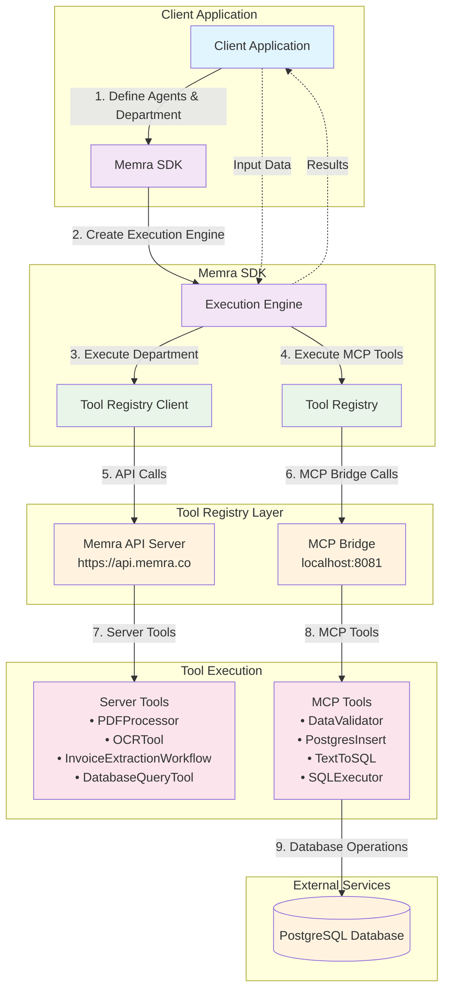
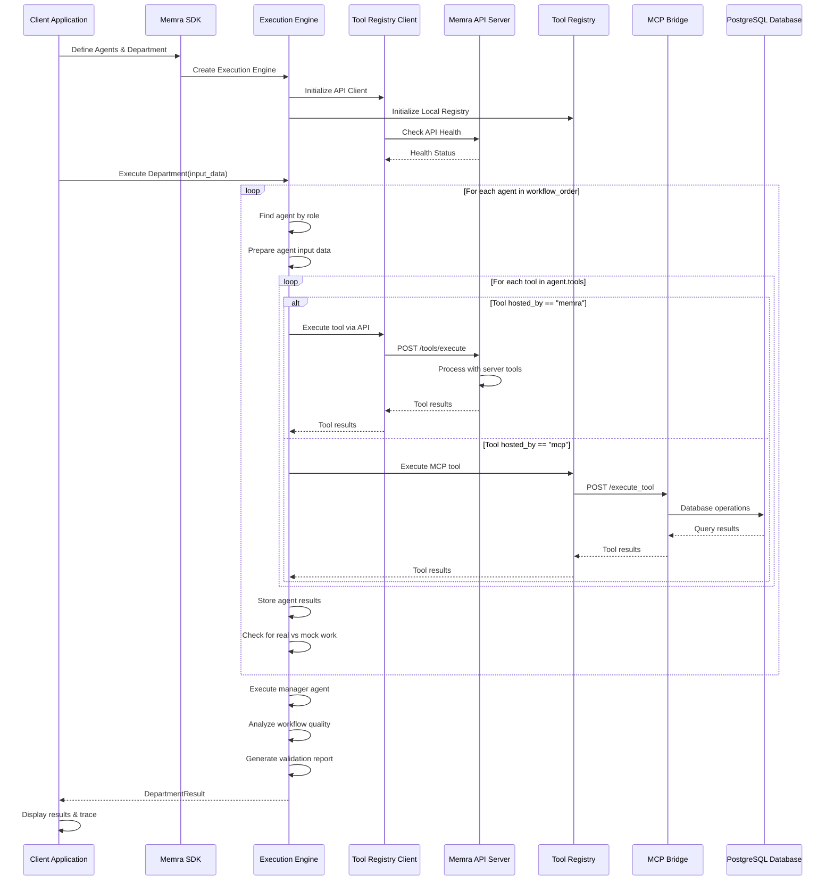
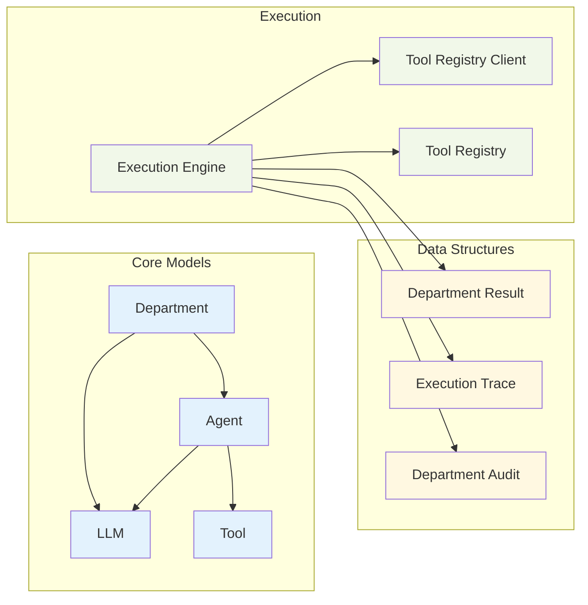
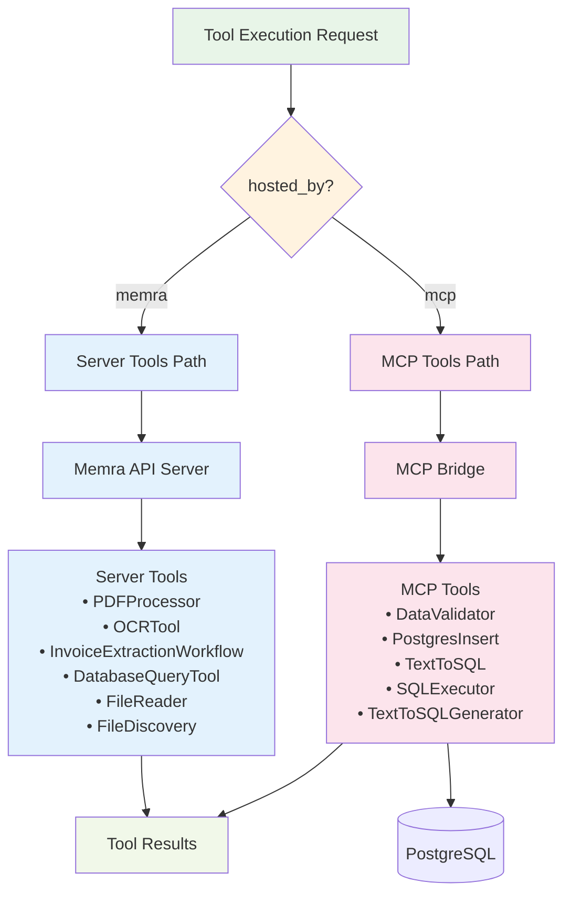

# Memra System Architecture

## System Overview

Memra is a declarative orchestration framework for AI-powered business workflows. Think of it as "Kubernetes for business logic" where agents are the pods and departments are the deployments.

## Architecture Diagram



## Detailed Workflow Diagram



## Component Relationships



## Tool Routing Architecture



## Key Features

### 1. **Declarative Workflow Definition**
- Define agents with roles, jobs, and tools
- Create departments with workflow order
- Specify execution policies and dependencies

### 2. **Hybrid Tool Execution**
- **Server Tools**: Heavy AI processing (PDF, OCR, ML) on Memra API
- **MCP Tools**: Database operations and local processing via MCP Bridge
- Automatic routing based on `hosted_by` configuration

### 3. **Intelligent Workflow Management**
- Sequential agent execution in workflow order
- Manager agent for final validation and quality assessment
- Real vs mock work detection and reporting
- Comprehensive execution tracing and auditing

### 4. **Production-Ready Features**
- API key authentication
- Health checks and status monitoring
- Error handling and retry logic
- Execution timeouts and policies
- Detailed audit trails

### 5. **Extensible Architecture**
- Plugin-based tool system
- Support for custom MCP tools
- Configurable LLM models per agent
- Context-aware execution

## Usage Example

```python
from memra import Agent, Department, LLM, ExecutionEngine

# Define agents
etl_agent = Agent(
    role="Data Engineer",
    job="Extract invoice schema from database",
    tools=[{"name": "DatabaseQueryTool", "hosted_by": "memra"}],
    output_key="invoice_schema"
)

parser_agent = Agent(
    role="Invoice Parser", 
    job="Extract structured data from invoice PDF",
    tools=[
        {"name": "PDFProcessor", "hosted_by": "memra"},
        {"name": "InvoiceExtractionWorkflow", "hosted_by": "memra"}
    ],
    input_keys=["file", "invoice_schema"],
    output_key="invoice_data"
)

# Create department
department = Department(
    name="Accounts Payable",
    mission="Process invoices accurately",
    agents=[etl_agent, parser_agent],
    workflow_order=["Data Engineer", "Invoice Parser"]
)

# Execute workflow
engine = ExecutionEngine()
result = engine.execute_department(department, {
    "file": "invoice.pdf",
    "connection": "postgresql://user@localhost/db"
})
```

This architecture provides a scalable, maintainable framework for building complex AI-powered business workflows with clear separation of concerns and flexible tool execution strategies. 